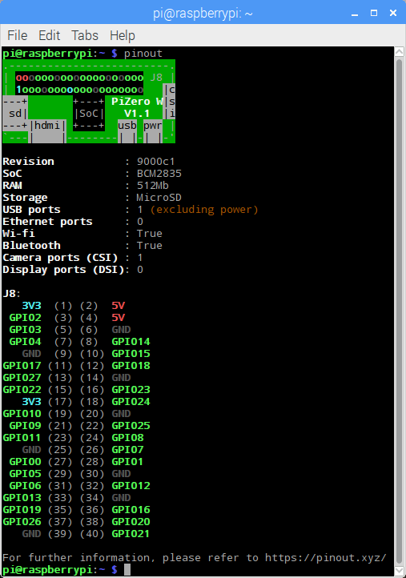

.. GPIO Zero: a library for controlling the Raspberry Pi's GPIO pins
..
.. Copyright (c) 2017-2023 Dave Jones <dave@waveform.org.uk>
.. Copyright (c) 2017-2018 Ben Nuttall <ben@bennuttall.com>
..
.. SPDX-License-Identifier: BSD-3-Clause

pinout
======

A utility for querying GPIO pin-out information.

.. only:: not builder_man

    .. image:: images/pinout_pi3.png
        :alt: A screenshot of the output from pinout. In a terminal window, a
              description of the board is shown at the top, followed by a
              colorful ASCII art rendition of the board, and finally a
              color-matched list of pins on the GPIO header.

Synopsis
--------

::

    pinout [-h] [-r REVISION] [-c] [-m] [-x]

Description
-----------

A utility for querying Raspberry Pi GPIO pin-out information. Running
:program:`pinout` on its own will output a board diagram, and GPIO header
diagram for the current Raspberry Pi. It is also possible to manually specify a
revision of Pi, or (by :doc:`remote_gpio`) to output information about a
remote Pi.

Options
-------

.. program:: pinout

.. option:: -h, --help

    Show a help message and exit

.. option:: -r REVISION, --revision REVISION

    Specifies a particular Raspberry Pi board revision code. The default is to
    autodetect revision of current device by reading :file:`/proc/cpuinfo`

.. option:: -c, --color

    Force colored output (by default, the output will include ANSI color codes
    if run in a color-capable terminal). See also :option:`pinout --monochrome`

.. option:: -m, --monochrome

    Force monochrome output. See also :option:`pinout --color`

.. option:: -x, --xyz

    Open `pinout.xyz`_ in the default web browser

Examples
--------

To output information about the current Raspberry Pi:

.. code-block:: console

    $ pinout

For a Raspberry Pi model 3B, this will output something like the following:

.. code-block:: none

    Description        : Raspberry Pi 3B rev 1.2
    Revision           : a02082
    SoC                : BCM2837
    RAM                : 1GB
    Storage            : MicroSD
    USB ports          : 4 (of which 0 USB3)
    Ethernet ports     : 1 (100Mbps max. speed)
    Wi-fi              : True
    Bluetooth          : True
    Camera ports (CSI) : 1
    Display ports (DSI): 1

    ,--------------------------------.
    | oooooooooooooooooooo J8     +====
    | 1ooooooooooooooooooo        | USB
    |                             +====
    |      Pi Model 3B  V1.2         |
    | |D      +---+               +====
    | |S      |SoC|               | USB
    | |I      +---+               +====
    | |0               C|            |
    |                  S|       +======
    |                  I| |A|   |   Net
    | pwr      |HDMI|  0| |u|   +======
    `-| |------|    |-----|x|--------'

    J8:
       3V3  (1) (2)  5V
     GPIO2  (3) (4)  5V
     GPIO3  (5) (6)  GND
     GPIO4  (7) (8)  GPIO14
       GND  (9) (10) GPIO15
    GPIO17 (11) (12) GPIO18
    GPIO27 (13) (14) GND
    GPIO22 (15) (16) GPIO23
       3V3 (17) (18) GPIO24
    GPIO10 (19) (20) GND
     GPIO9 (21) (22) GPIO25
    GPIO11 (23) (24) GPIO8
       GND (25) (26) GPIO7
     GPIO0 (27) (28) GPIO1
     GPIO5 (29) (30) GND
     GPIO6 (31) (32) GPIO12
    GPIO13 (33) (34) GND
    GPIO19 (35) (36) GPIO16
    GPIO26 (37) (38) GPIO20
       GND (39) (40) GPIO21

    For further information, please refer to https://pinout.xyz/

By default, if stdout is a console that supports color, ANSI codes will be used
to produce color output. Output can be forced to be :option:`--monochrome`:

.. code-block:: console

    $ pinout --monochrome

Or forced to be :option:`--color`, in case you are redirecting to something
capable of supporting ANSI codes:

.. code-block:: console

    $ pinout --color | less -SR

To manually specify the revision of Pi you want to query, use
:option:`--revision`. The tool understands both old-style `revision codes`_
(such as for the model B):

.. code-block:: console

    $ pinout -r 000d

Or new-style `revision codes`_ (such as for the Pi Zero W):

.. code-block:: console

    $ pinout -r 9000c1

You can also use the tool with :doc:`remote_gpio` to query remote Raspberry
Pi's:

.. code-block:: console

    $ GPIOZERO_PIN_FACTORY=pigpio PIGPIO_ADDR=other_pi pinout

Or run the tool directly on a PC using the mock pin implementation (although in
this case you'll almost certainly want to specify the Pi revision manually):

.. code-block:: console

    $ GPIOZERO_PIN_FACTORY=mock pinout -r a22042

.. only:: builder_man

    See Also
    --------

    :manpage:`pintest(1)`, :manpage:`remote-gpio(7)`,
    :manpage:`gpiozero-env(7)`

.. _pinout.xyz: https://pinout.xyz/
.. _revision codes: https://www.raspberrypi.com/documentation/computers/raspberry-pi.html#raspberry-pi-revision-codes
