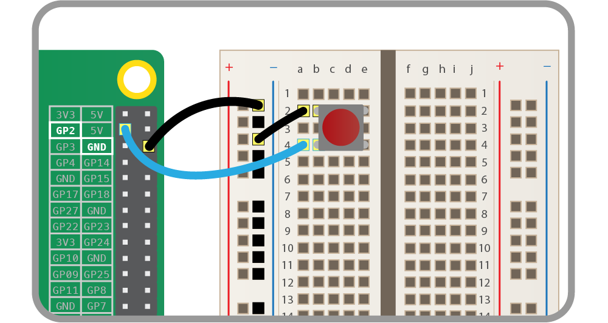
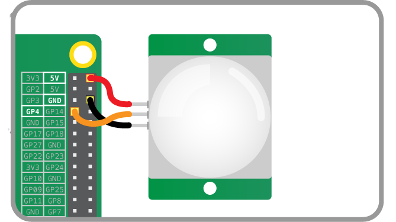

# Input Devices

These input device component interfaces have been provided for simple use of
everyday components.

Components must be wired up correctly before used in code.

*Note all GPIO pin numbers use BCM numbering. See the [notes](notes.md) page
for more information.*

## Button

A physical push button or switch.

### Wiring

Connect one side of the button to a ground pin, and the other to any GPIO pin:



*Alternatively, connect to 3V3 and to a GPIO, and set `pull_up` to `False` when
you create your `Button` object.*

### Code

Ensure the `Button` class is imported at the top of the file:

```python
from gpiozero import Button
```

Create a `Button` object by passing in the pin number the button is connected
to:

```python
button = Button(2)
```

The default behaviour is to set the *pull* state of the button to *up*. To
change this behaviour, set the `pull_up` argument to `False` when creating your
`Button` object.

```python
button = Button(pin=2, pull_up=False)
```

### Methods

| Method | Description | Arguments |
| ------ | ----------- | --------- |
| `wait_for_press()`   | Halt the program until the button is pressed.  | `timeout` - The number of seconds to wait before proceeding if no event is detected. Default: `None`  |
| `wait_for_release()` | Halt the program until the button is released. | `timeout` - The number of seconds to wait before proceeding if no event is detected. Default: `None`  |

### Properties

| Property | Description | Type |
| -------- | ----------- | ---- |
| `pin`           | The GPIO pin number the button is connected to.                          | Integer          |
| `is_pressed`    | The current state of the pin (`True` if pressed; otherwise `False`).     | Boolean          |
| `pull_up`       | The pull state of the pin (`True` if pulled up; `False` if pulled down). | Boolean          |
| `when_pressed`  | A reference to the function to be called when the button is pressed.     | None or Function |
| `when_released` | A reference to the function to be called when the button is released.    | None or Function |

## Motion Sensor

A PIR (Passive Infra-Red) motion sensor.

### Wiring

Connect the pin labelled `VCC` to a 5V pin; connect the one labelled `GND` to
a ground pin; and connect the one labelled `OUT` to any GPIO pin:



### Code

Ensure the `MotionSensor` class is imported at the top of the file:

```python
from gpiozero import MotionSensor
```

Create a `MotionSensor` object by passing in the pin number the sensor is
connected to:

```python
pir = MotionSensor(4)
```

### Methods

| Method | Description | Arguments |
| ------ | ----------- | --------- |
| `wait_for_motion()`    | Halt the program until motion is detected.    | `timeout` - The number of seconds to wait before proceeding if no motion is detected. Default: `None`    |
| `wait_for_no_motion()` | Halt the program until no motion is detected. | `timeout` - The number of seconds to wait before proceeding if motion is still detected. Default: `None` |

### Properties

| Property | Description | Type |
| -------- | ----------- | ---- |
| `pin`    | The GPIO pin number the sensor is connected to. | Integer |
| `motion_detected` | The current state of the sensor (`True` if motion is detected; otherwise `False`). | Boolean |
| `when_motion` | A reference to the function to be called when motion is detected. | None or Function |
| `when_no_motion` | A reference to the function to be called when no motion is detected. | None or Function |

## Light Sensor

An LDR (Light Dependent Resistor) Light Sensor.

### Wiring

...

### Code

Ensure the `LightSensor` class is imported at the top of the file:

```python
from gpiozero import LightSensor
```

Create a `LightSensor` object by passing in the pin number the sensor is
connected to:

```python
light = LightSensor(4)
```

### Methods

| Method | Description | Arguments |
| ------ | ----------- | --------- |
| `wait_for_light()` | Halt the program until light is detected.    | `timeout` - The number of seconds to wait before proceeding if light is not detected. Default: `None` |
| `wait_for_dark()`  | Halt the program until darkness is detected. | `timeout` - The number of seconds to wait before proceeding if darkness is not detected. Default: `None` |

### Properties

| Property | Description | Type |
| -------- | ----------- | ---- |
| `pin`            | The GPIO pin number the sensor is connected to.                       | Integer          |
| `light_detected` | The current state of the sensor (`True` if light; otherwise `False`). | Boolean          |
| `when_light`     | A reference to the function to be called when light is detected.      | None or Function |
| `when_dark`      | A reference to the function to be called when darkness is detected.   | None or Function |

## Temperature Sensor

One-wire Digital Temperature Sensor.

### Wiring

...

### Code

Ensure the `TemperatureSensor` class is imported at the top of the file:

```python
from gpiozero import TemperatureSensor
```

Create a `TemperatureSensor` object:

```python
temp = TemperatureSensor()
```

### Methods

...

### Properties

| Property | Description | Type |
| -------- | ----------- | ---- |
| `value`  | The current temperature reading in degrees Celsius. | Float |

## MCP3008 Analogue-to-Digital Converter

MCP3008 ADC (Analogue-to-Digital converter).

The MCP3008 chip provides access to up to 8 analogue inputs, such as
potentiometers, and read their values in digital form.

### Wiring

...

### Code

Ensure the `MCP3008` class is imported at the top of the file:

```python
from gpiozero import MCP3008
```

Create an `MCP3008` object:

```python
pot = MCP3008()
```

Read the value of the device:

```python
print(pot.value)
```

Alternatively, access an input value with the `MCP3008`'s context manager:

```python
with MCP3008() as pot:
    print(pot.value)
```

It is possible to specify the `device` and the `channel` you wish to access.
The previous example used the default value of `0` for each of these. To
specify them, pass them in as arguments:

```python
pot = MCP3008(device=1, channel=7)
```

## MCP3004 Analogue-to-Digital Converter

MCP3004 ADC (Analogue-to-Digital converter).

The MCP3004 chip provides access to up to 4 analogue inputs, such as
potentiometers, and read their values in digital form.

The interface is identical to `MCP3008`.
