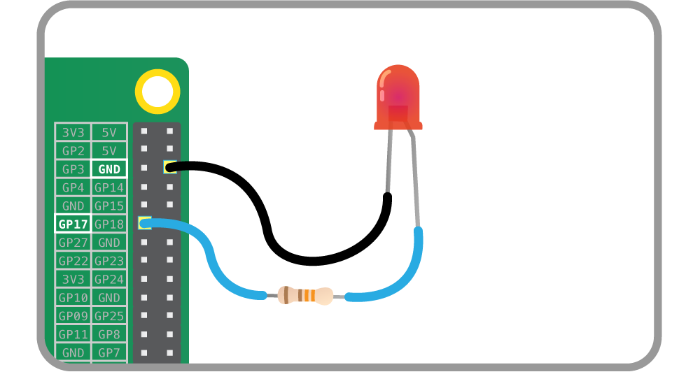

# Output Devices

These output device component interfaces have been provided for simple use of
everyday components.

Components must be wired up correctly before used in code.

*Note all GPIO pin numbers use BCM numbering. See the [notes](notes.md) page
for more information.*

## LED

An LED (Light emitting diode) component.

### Wiring

Connect the cathode (the short leg) of the LED to a ground pin, and connect the
anode (the longer leg) to any GPIO pin, with a current limiting resistor in
between:



*Altenatively, use a breadboard to wire up the LED in the same way*

### Code

Ensure the `LED` class is imported at the top of the file:

```python
from gpiozero import LED
```

Create an `LED` object by passing in the pin number the LED is connected to:

```python
led = LED(17)
```

### Methods

| Method | Description | Arguments |
| ------ | ----------- | --------- |
| `on()` | Turn the LED on. | None |
| `off()` | Turn the LED off. | None |
| `toggle()` | Toggle the LED. If it's on, turn it off; if it's off, turn it on. | None |
| `blink()` | Make the LED turn on and off repeatedly. | `on_time` - The amount of time (in seconds) for the LED to be on each iteration. Default: `1` |
|           |                                          | `off_time` - The amount of time (in seconds) for the LED to be off each iteration. Default: `1` |
|           |                                          | `n` - The number of iterations. `None` means infinite. Default: `None` |
|           |                                          | `background` - If True, start a background thread to continue blinking and return immediately. If False, only return when the blink is finished (warning: the default value of n will result in this method never returning). Default: `True` |

### Properties

| Property | Description | Type |
| -------- | ----------- | ---- |
| `pin`    | The GPIO pin number the LED is connected to. | Integer |
| `is_active` | The current state of the pin (`True` if on; `False` if off). | Boolean |

## Buzzer

A digital Buzzer component.

### Wiring

Connect the negative pin of the buzzer to a ground pin, and connect the
positive side to any GPIO pin:

...

### Code

Ensure the `Buzzer` class is imported at the top of the file:

```python
from gpiozero import Buzzer
```

Create a `Buzzer` object by passing in the pin number the buzzer is connected
to:

```python
buzzer = Buzzer(3)
```

### Methods

| Method | Description | Arguments |
| ------ | ----------- | --------- |
| `on()` | Turn the buzzer on. | None |
| `off()` | Turn the buzzer off. | None |
| `toggle()` | Toggle the buzzer. If it's on, turn it off; if it's off, turn it on. | None |
| `blink()` | Make the LED turn on and off repeatedly. | `on_time` - The amount of time (in seconds) for the LED to be on each iteration. Default: `1` |
|           |                                          | `off_time` - The amount of time (in seconds) for the LED to be off each iteration. Default: `1` |
|           |                                          | `n` - The number of iterations. `None` means infinite. Default: `None` |
|           |                                          | `background` - If True, start a background thread to continue blinking and return immediately. If False, only return when the blink is finished (warning: the default value of n will result in this method never returning). Default: `True` |

### Properties

| Property | Description | Type |
| -------- | ----------- | ---- |
| `pin`    | The GPIO pin number the buzzer is connected to. | Integer |
| `is_active` | The current state of the pin (`True` if on; `False` if off). | Boolean |

## RGB LED

A full colour LED component (made up of Red, Green and Blue LEDs).

### Wiring

Connect the common cathode (the longest leg) to a ground pin; connect each of
the other legs (representing the red, green and blue components of the LED) to
any GPIO pins, each with a current limiting resistor in between:

...

### Code

Ensure the `RGBLED` class is imported at the top of the file:

```python
from gpiozero import RGBLED
```

Create a `RGBLED` object by passing in the LED pin numbers by name:

```python
led = RGBLED(red=2, green=3, blue=4)
```

or just in order (red, green, blue):

```python
led = RGBLED(2, 3, 4)
```

### Methods

| Method | Description | Arguments |
| ------ | ----------- | --------- |
| `on()` | Turn all the LEDs on (makes white light). | None |
| `off()` | Turn all the LEDs off. | None |
| `toggle()` | Toggle the LED. If it's on (at all), turn it off; if it's off, turn it on. | None |

### Properties

| Property | Description | Type |
| -------- | ----------- | ---- |
| `red`    | The brightness value of the red LED (0 to 255).     | Integer |
| `green`  | The brightness value of the green LED (0 to 255).   | Integer |
| `blue`   | The brightness value of the blue LED (0 to 255).    | Integer |
| `rgb`    | The brightness values of the three LEDs (0 to 255). | Tuple   |

## Motor

Generic bi-directional motor.

### Wiring

Attach a Motor Controller Board to your Pi, connect a battery pack to the Motor
Controller Board, and connect each side of the motor to any GPIO pin:

...

### Code

Ensure the `Motor` class is imported at the top of the file:

```python
from gpiozero import Motor
```

Create a `Motor` object by passing in the pin numbers the motor is connected to:

```python
motor = Motor(forward=17, back=18)
```

### Methods

| Method | Description | Arguments |
| ------ | ----------- | --------- |
| `forward()` | Drive the motor forwards. | `speed` - Speed at which to drive the motor, `0` to `1`. Default: `1` |
| `backward()` | Drive the motor backwards. | `speed` - Speed at which to drive the motor, `0` to `1`. Default: `1` |
| `stop()` | Stop the motor. | None |
