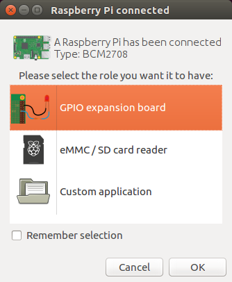
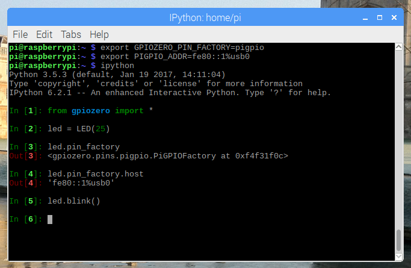

.. GPIO Zero: a library for controlling the Raspberry Pi's GPIO pins
.. Copyright (c) 2018-2019 Ben Nuttall <ben@bennuttall.com>
.. Copyright (c) 2019 Dave Jones <dave@waveform.org.uk>
..
.. Redistribution and use in source and binary forms, with or without
.. modification, are permitted provided that the following conditions are met:
..
.. * Redistributions of source code must retain the above copyright notice,
..   this list of conditions and the following disclaimer.
..
.. * Redistributions in binary form must reproduce the above copyright notice,
..   this list of conditions and the following disclaimer in the documentation
..   and/or other materials provided with the distribution.
..
.. * Neither the name of the copyright holder nor the names of its contributors
..   may be used to endorse or promote products derived from this software
..   without specific prior written permission.
..
.. THIS SOFTWARE IS PROVIDED BY THE COPYRIGHT HOLDERS AND CONTRIBUTORS "AS IS"
.. AND ANY EXPRESS OR IMPLIED WARRANTIES, INCLUDING, BUT NOT LIMITED TO, THE
.. IMPLIED WARRANTIES OF MERCHANTABILITY AND FITNESS FOR A PARTICULAR PURPOSE
.. ARE DISCLAIMED. IN NO EVENT SHALL THE COPYRIGHT HOLDER OR CONTRIBUTORS BE
.. LIABLE FOR ANY DIRECT, INDIRECT, INCIDENTAL, SPECIAL, EXEMPLARY, OR
.. CONSEQUENTIAL DAMAGES (INCLUDING, BUT NOT LIMITED TO, PROCUREMENT OF
.. SUBSTITUTE GOODS OR SERVICES; LOSS OF USE, DATA, OR PROFITS; OR BUSINESS
.. INTERRUPTION) HOWEVER CAUSED AND ON ANY THEORY OF LIABILITY, WHETHER IN
.. CONTRACT, STRICT LIABILITY, OR TORT (INCLUDING NEGLIGENCE OR OTHERWISE)
.. ARISING IN ANY WAY OUT OF THE USE OF THIS SOFTWARE, EVEN IF ADVISED OF THE
.. POSSIBILITY OF SUCH DAMAGE.

===============
Pi Zero USB OTG
===============

The `Raspberry Pi Zero`_ and `Pi Zero W`_ feature a USB OTG port, allowing
users to configure the device as (amongst other things) an Ethernet device. In
this mode, it is possible to control the Pi Zero's GPIO pins over USB from
another computer using the :doc:`remote GPIO <remote_gpio>` feature.

GPIO expander method - no SD card required
==========================================

The GPIO expander method allows you to boot the Pi Zero over USB from the PC,
without an SD card. Your PC sends the required boot firmware to the Pi over the
USB cable, launching a mini version of Raspbian and booting it in RAM. The OS
then starts the pigpio daemon, allowing "remote" access over the USB cable.

At the time of writing, this is only possible using either the Raspberry Pi
Desktop x86 OS, or Ubuntu (or a derivative), or from another Raspberry Pi.
Usage from Windows and Mac OS is not supported at present.

Raspberry Pi Desktop x86 setup
------------------------------

1. Download an ISO of the `Raspberry Pi Desktop OS`_ from raspberrypi.org

2. Write the image to a USB stick or burn to a DVD.

3. Live boot your PC or Mac into the OS (select "Run with persistence" and your
   computer will be back to normal afterwards).

Raspberry Pi (Raspbian) setup
-----------------------------

1. Update your package list and install the ``usbbootgui`` package:

.. code-block:: console

    $ sudo apt update
    $ sudo apt install usbbootgui

Ubuntu setup
------------

1. Add the Raspberry Pi PPA to your system:

.. code-block:: console

    $ sudo add-apt-repository ppa:rpi-distro/ppa

2. If you have previously installed ``gpiozero`` or ``pigpio`` with pip,
uninstall these first:

.. code-block:: console

    $ sudo pip3 uninstall gpiozero pigpio

3. Install the required packages from the PPA:

.. code-block:: console

    $ sudo apt install usbbootgui pigpio python3-gpiozero python3-pigpio

Access the GPIOs
----------------

Once your PC or Pi has the USB Boot GUI tool installed, connecting a Pi Zero
will automatically launch a prompt to select a role for the device. Select
"GPIO expansion board" and continue:

It will take 30 seconds or so to flash it, then the dialogue will disappear.

Raspberry Pi Desktop and Raspbian will name your Pi Zero connection ``usb0``.
On Ubuntu, this will likely be something else. You can ping it using the
address ``fe80::1%`` followed by the connection string. You can look this up
using ``ifconfig``.

Set the :envvar:`GPIOZERO_PIN_FACTORY` and :envvar:`PIGPIO_ADDR` environment
variables on your PC so GPIO Zero connects to the "remote" Pi Zero:

.. code-block:: console

    $ export GPIOZERO_PIN_FACTORY=pigpio
    $ export PIGPIO_ADDR=fe80::1%usb0

Now any GPIO Zero code you run on the PC will use the GPIOs of the attached Pi
Zero:

Alternatively, you can set the pin factory in-line, as explained in
:doc:`remote_gpio`.

Read more on the GPIO expander in blog posts on `raspberrypi.org`_ and
`bennuttall.com`_.

Legacy method - SD card required
================================

The legacy method requires the Pi Zero to have a Raspbian SD card inserted.

Start by creating a Raspbian (desktop or lite) SD card, and then configure the
boot partition like so:

1. Edit :file:`config.txt` and add ``dtoverlay=dwc2`` on a new line, then save
   the file.

2. Create an empty file called :file:`ssh` (no file extension) and save it in
   the boot partition.

3. Edit :file:`cmdline.txt`` and insert ``modules-load=dwc2,g_ether`` after
   ``rootwait``.

(See guides on `blog.gbaman.info`_ and `learn.adafruit.com`_ for more detailed
instructions)

Then connect the Pi Zero to your computer using a micro USB cable (connecting
it to the USB port, not the power port). You'll see the indicator LED flashing
as the Pi Zero boots. When it's ready, you will be able to ping and SSH into it
using the hostname ``raspberrypi.local``. SSH into the Pi Zero, install pigpio
and run the pigpio daemon.

Then, drop out of the SSH session and you can run Python code on your computer
to control devices attached to the Pi Zero, referencing it by its hostname (or
IP address if you know it), for example:

.. code-block:: console

    $ GPIOZERO_PIN_FACTORY=pigpio PIGPIO_ADDR=raspberrypi.local python3 led.py

.. _Raspberry Pi Zero: https://www.raspberrypi.org/products/raspberry-pi-zero/
.. _Pi Zero W: https://www.raspberrypi.org/products/raspberry-pi-zero-w/
.. _Raspberry Pi Desktop OS: https://www.raspberrypi.org/downloads/raspberry-pi-desktop/
.. _raspberrypi.org: https://www.raspberrypi.org/blog/gpio-expander/
.. _bennuttall.com: http://bennuttall.com/raspberry-pi-zero-gpio-expander/
.. _blog.gbaman.info: http://blog.gbaman.info/?p=791
.. _learn.adafruit.com: https://learn.adafruit.com/turning-your-raspberry-pi-zero-into-a-usb-gadget/ethernet-gadget
