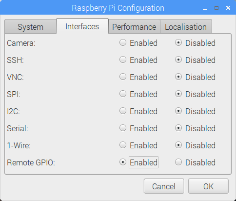

=======================
Configuring Remote GPIO
=======================

.. currentmodule:: gpiozero

GPIO Zero supports a number of different pin implementations (low-level pin
libraries which deal with the GPIO pins directly). By default, the `RPi.GPIO`_
library is used (assuming it is installed on your system), but you can
optionally specify one to use. For more information, see the :doc:`api_pins`
documentation page.

One of the pin libraries supported, `pigpio`_, provides the ability to control
GPIO pins remotely over the network, which means you can use GPIO Zero to
control devices connected to a Raspberry Pi on the network. You can do this
from another Raspberry Pi, or even from a PC.

See the :doc:`recipes_remote_gpio` page for examples on how remote pins can be
used.

Preparing the Raspberry Pi
==========================

If you're using Raspbian (desktop - not Raspbian Lite) then you have everything
you need to use the remote GPIO feature. If you're using Raspbian Lite, or
another distribution, you'll need to install pigpio:

.. code-block:: console

    $ sudo apt install pigpio

Alternatively, pigpio is available from `abyz.me.uk`_.

You'll need to enable remote connections, and launch the pigpio daemon on the
Raspberry Pi.

Enable remote connections
-------------------------

On the Raspbian desktop image, you can enable **Remote GPIO** in the Raspberry
Pi configuration tool:

Alternatively, enter ``sudo raspi-config`` on the command line, and enable
Remote GPIO. This is functionally equivalent to the desktop method.

This will allow remote connections (until disabled) when the pigpio daemon is
launched using `systemctl` (see below). It will also launch the pigpio daemon
for the current session. Therefore, nothing further is required for the current
session, but after a reboot, a `systemctl` command will be required.

Command-line: systemctl
-----------------------

To automate running the daemon at boot time, run:

.. code-block:: console

    $ sudo systemctl enable pigpiod

To run the daemon once using ``systemctl``, run:

.. code-block:: console

    $ sudo systemctl start pigpiod

Command-line: pigpiod
---------------------

Another option is to launch the pigpio daemon manually:

.. code-block:: console

    $ sudo pigpiod

This is for single-session-use and will not persist after a reboot. However,
this method can be used to allow connections from a specific IP address, using
the ``-n`` flag. For example:

.. code-block:: console

    $ sudo pigpiod -n localhost # allow localhost only
    $ sudo pigpiod -n 192.168.1.65 # allow 192.168.1.65 only
    $ sudo pigpiod -n localhost -n 192.168.1.65 # allow localhost and 192.168.1.65 only

.. note::

    Note that running ``sudo pigpiod`` will not honour the Remote GPIO
    configuration setting (i.e. without the ``-n`` flag it will allow remote
    connections even if the remote setting is disabled), but ``sudo systemctl
    enable pigpiod`` or ``sudo systemctl start pigpiod`` will not allow remote
    connections unless configured accordingly.

Preparing the control computer
==============================

If the control computer (the computer you're running your Python code from) is
a Raspberry Pi running Raspbian (or a PC running `Raspberry Pi Desktop x86`_),
then you have everything you need. If you're using another Linux distribution,
Mac OS or Windows then you'll need to install the ``pigpio`` Python library on
the PC.

Raspberry Pi
------------

First, update your repositories list:

.. code-block:: console

    $ sudo apt update

Then install GPIO Zero and the pigpio library for Python 3:

.. code-block:: console

    $ sudo apt install python3-gpiozero python3-pigpio

or Python 2:

.. code-block:: console

    $ sudo apt install python-gpiozero python-pigpio

Alternatively, install with pip:

.. code-block:: console

    $ sudo pip3 install gpiozero pigpio

or for Python 2:

.. code-block:: console

    $ sudo pip install gpiozero pigpio

Linux
-----

First, update your distribution's repositories list. For example:

.. code-block:: console

    $ sudo apt update

Then install pip for Python 3:

.. code-block:: console

    $ sudo apt install python3-pip

or Python 2:

.. code-block:: console

    $ sudo apt install python-pip

(Alternatively, install pip with `get-pip`_.)

Next, install GPIO Zero and pigpio for Python 3:

.. code-block:: console

    $ sudo pip3 install gpiozero pigpio

or Python 2:

.. code-block:: console

    $ sudo pip install gpiozero pigpio

Mac OS
------

First, install pip. If you installed Python 3 using brew, you will already have
pip. If not, install pip with `get-pip`_.

Next, install GPIO Zero and pigpio with pip:

.. code-block:: console

    $ pip3 install gpiozero pigpio

Or for Python 2:

.. code-block:: console

    $ pip install gpiozero pigpio

Windows
-------

First, install pip by `following this guide`_. Next, install GPIO Zero and
pigpio with pip:

.. code-block:: doscon

    C:\Users\user1> pip install gpiozero pigpio

Environment variables
=====================

The simplest way to use devices with remote pins is to set the ``PIGPIO_ADDR``
environment variable to the IP address of the desired Raspberry Pi. You must
run your Python script or launch your development environment with the
environment variable set using the command line. For example, one of the
following:

.. code-block:: console

    $ PIGPIO_ADDR=192.168.1.3 python3 hello.py
    $ PIGPIO_ADDR=192.168.1.3 python3
    $ PIGPIO_ADDR=192.168.1.3 ipython3
    $ PIGPIO_ADDR=192.168.1.3 idle3 &

If you are running this from a PC (not a Raspberry Pi) with gpiozero and the
pigpio Python library installed, this will work with no further configuration.
However, if you are running this from a Raspberry Pi, you will also need to
ensure the default pin factory is set to ``PiGPIOFactory``. If ``RPi.GPIO`` is
installed, this will be selected as the default pin factory, so either
uninstall it, or use another environment variable to set it to
``PiGPIOFactory``:

.. code-block:: console

    $ GPIOZERO_PIN_FACTORY=pigpio PIGPIO_ADDR=192.168.1.3 python3 hello.py

This usage will set the pin factory to :class:`PiGPIOFactory` with a default
host of ``192.168.1.3``. The pin factory can be changed inline in the code, as
seen in the following sections.

With this usage, you can write gpiozero code like you would on a Raspberry Pi,
with no modifications needed. For example:

.. literalinclude:: examples/led_1.py

When run with:

.. code-block:: console

    $ PIGPIO_ADDR=192.168.1.3 python3 led.py

will flash the LED connected to pin 17 of the Raspberry Pi with the IP address
``192.168.1.3``. And:

.. code-block:: console

    $ PIGPIO_ADDR=192.168.1.4 python3 led.py

will flash the LED connected to pin 17 of the Raspberry Pi with the IP address
``192.168.1.4``, without any code changes, as long as the Raspberry Pi has the
pigpio daemon running.

.. note::

    When running code directly on a Raspberry Pi, any pin factory can be used
    (assuming the relevant library is installed), but when a device is used
    remotely, only :class:`PiGPIOFactory` can be used, as pigpio is the only
    pin library which supports remote GPIO.

Pin factories
=============

An alternative (or additional) method of configuring gpiozero objects to use
remote pins is to create instances of :class:`PiGPIOFactory` objects, and use
them when instantiating device objects. For example, with no environment
variables set:

.. literalinclude:: examples/led_remote_1.py

This allows devices on multiple Raspberry Pis to be used in the same script:

.. literalinclude:: examples/led_remote_2.py

You can, of course, continue to create gpiozero device objects as normal, and
create others using remote pins. For example, if run on a Raspberry Pi, the
following script will flash an LED on the controller Pi, and also on another Pi
on the network:

.. literalinclude:: examples/led_remote_3.py

Alternatively, when run with the environment variables
``GPIOZERO_PIN_FACTORY=pigpio PIGPIO_ADDR=192.168.1.3`` set, the following
script will behave exactly the same as the previous one:

.. literalinclude:: examples/led_remote_4.py

Of course, multiple IP addresses can be used:

.. literalinclude:: examples/led_remote_5.py

Note that these examples use the :class:`LED` class, which takes a ``pin``
argument to initialise. Some classes, particularly those representing HATs and
other add-on boards, do not require their pin numbers to be specified. However,
it is still possible to use remote pins with these devices, either using
environment variables, :attr:`Device.pin_factory`, or the ``pin_factory``
keyword argument:

.. literalinclude:: examples/traffichat_remote_1.py

This also allows you to swap between two IP addresses and create instances of
multiple HATs connected to different Pis:

.. literalinclude:: examples/traffichat_remote_2.py

You could even use a HAT which is not supported by GPIO Zero (such as the
`Sense HAT`_) on one Pi, and use remote pins to control another over the
network:

.. literalinclude:: examples/sense_hat_remote.py

Note that in this case, the Sense HAT code must be run locally, and the GPIO
remotely.

Remote GPIO usage
=================

Continue to:

* :doc:`recipes_remote_gpio`
* :doc:`pi_zero_otg`

.. _RPi.GPIO: https://pypi.python.org/pypi/RPi.GPIO
.. _pigpio: http://abyz.me.uk/rpi/pigpio/python.html
.. _abyz.me.uk: http://abyz.me.uk/rpi/pigpio/download.html
.. _Raspberry Pi Desktop x86: https://www.raspberrypi.org/downloads/raspberry-pi-desktop/
.. _get-pip: https://pip.pypa.io/en/stable/installing/
.. _following this guide: https://www.raspberrypi.org/learning/using-pip-on-windows/worksheet/
.. _Sense HAT: https://www.raspberrypi.org/products/sense-hat/
